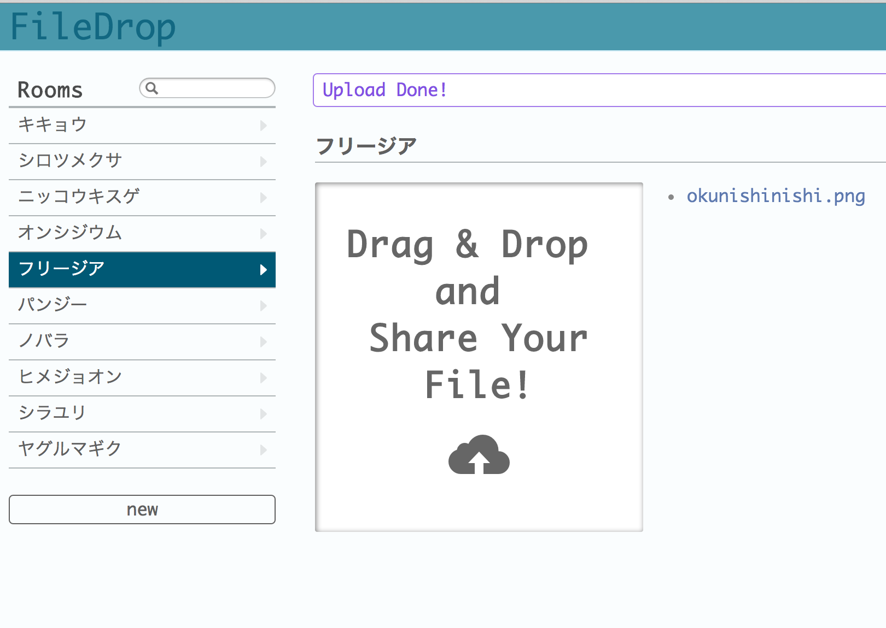

filedrop
======

Web app to share files.




requirements
------
+ [Node.js](http://nodejs.org/)
+ [MongoDB](http://www.mongodb.org/)


quick start
------
```bash
    npm install
    node app.js
```

Load test data
```bash
    node test/data/load_data.js 
```